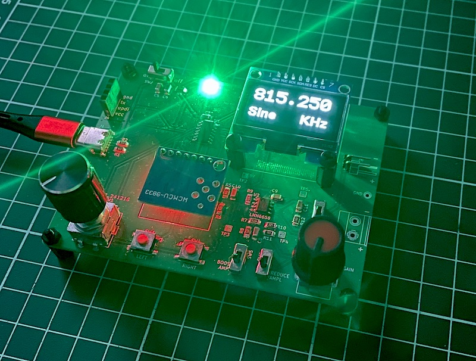
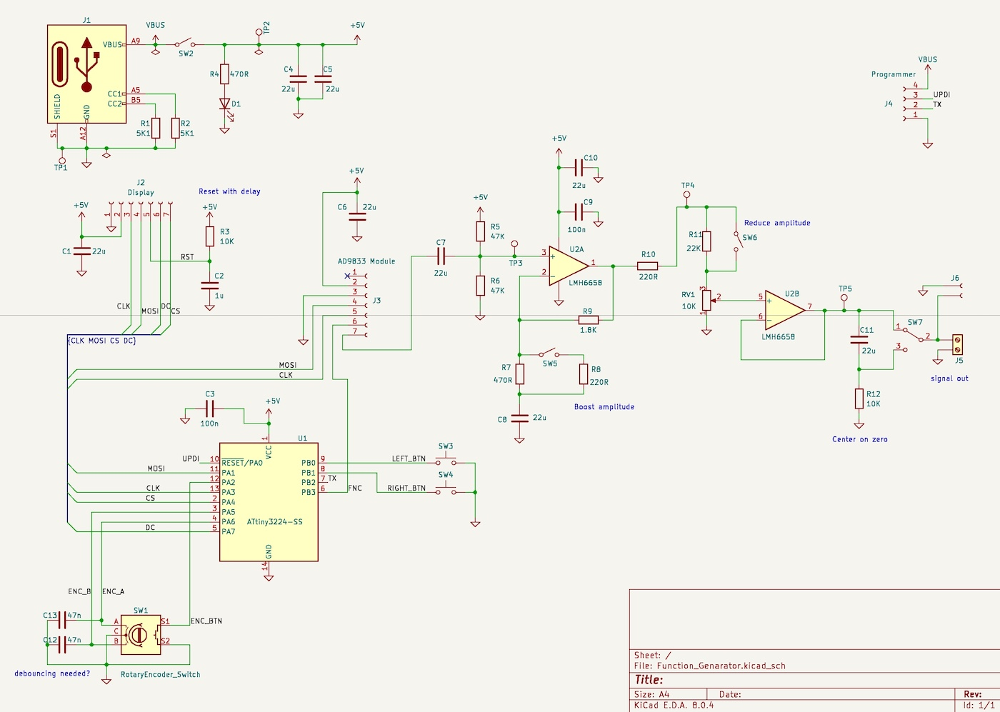
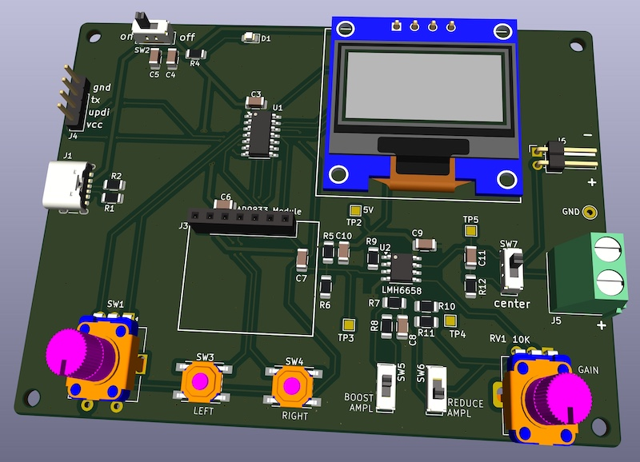

# Function Generator 5MHz

Simple low power waveform generator based in the **AD9833 module**, capable of producing sine, triangular, and square wave outputs.
An Attiny3224 IC controls the system with a rotary encoder, a potentiometer, some buttons and a small display. It is powered with a USB-C connector. 

The frequency range goes from 1 Hz to 7 MHz and the amplitude can go from less than 20mV to almost 3V.
Above 4 Mhz the maximum amplitude decreases to about 1.6 V. There is a '*boost*' button to double the gain in MHz range, and another one to reduce it to achieve small amplitudes.

The sine wave looks good up to 5 MHz and then starts to show some distortion.

The AD9833 module produces a signal with an amplitude of about 600mV. To amplify it we need a very fast opamp, the **LMH6658**. It has a 140 MHz GBWP and a slew rate of 700 V/μs. With it we achieve an amplitude of about 2.5V peak to peak. A *regular* opamp won't be able to amplify much the signal above 500 KHz.

Sine wave at 2.2 MHz:

To test in a breadboard you should solder the opamp on a small SOIC-8 adapter, and solder the gain resistors and decoupling capacitors directly in the adapter pins, to avoid problems with the breadboard at relative high frequencies.
And you should aslo set the oscilloscope probes to 10X.

With the rotary encoder the frequency can be adjusted. It sweeps each digit separately.  The potentiometer is for the amplitude adjustment. 

Sine wave at 5 KHz:

The schematic:

And the PCB:

The PCB could be reduced better and arranged better. The first version was using an ESP32, but with the Attiny is enough and simpler. The software could be also improved, but it's already fully functional.

